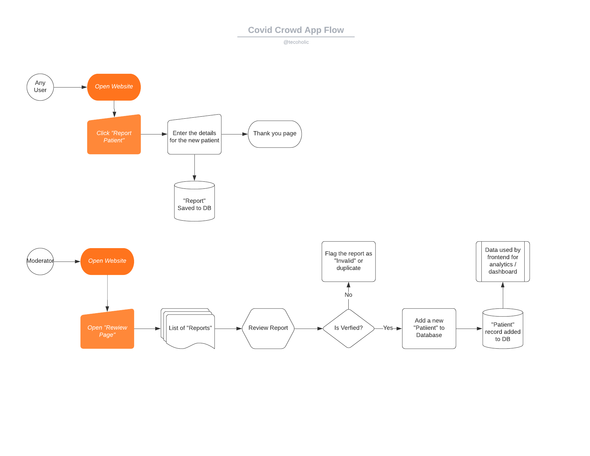

# CovidCrowd

A crowd-sourcing platform for the Covid-19 Pandemic

## Workflow




## Development

1. Install SQLite3 and Spatialite

```shell script
sudo apt install libsqlite3-mod-spatialite
```

2. Setup virtual environment

````shell script
python3 -m venv env
source env/bin/activate
pip install -r requirements.txt
````

3. Generate the local db

```shell script
python manage.py migrate
```

4. To access the admin pages - create a super user

```shell script
python manage.py createsuperuser
```
